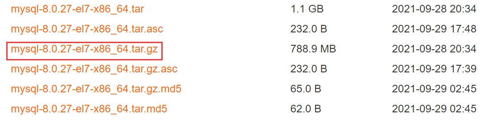

# 安装和配置mysql8
---

- **卸载MariaDB**
```shell
# 卸载
rpm -qa|grep mariadb
rpm -e --nodeps 文件名

# 查看卸载是否成功
rpm -qa|grep mariadb
```

- **卸载旧版mysql**
```shell
systemctl stop mysqld
rpm -e --nodeps mysql文件名
```

- **下载mysql**

[阿里云镜像网站下载](https://mirrors.aliyun.com/mysql/MySQL-8.0/?spm=a2c6h.25603864.0.0.17ec712bVMnKOv)



- **解压文件**
```shell
tar -zxvf mysql-8.0.27-el7-x86_64.tar.gz -C /usr/local/mysql8
```

- **添加环境变量**
```shell
# 打开.bashellrc文件
cd ~ && vim .bashellrc

# 添加环境变量
PATH="$PATH":/usr/local/mysql8/bin

# 保存退出
```

- **创建用户组和用户**
```shell
groupadd mysql
useradd -r -g mysql mysql
```

- **创建MySQL数据存放目录**
```shell
mkdir -p /data/mysql8_data
```

- **更改文件夹权限**
```shell
chown -R mysql:mysql /data/mysql8_data
chmod -R 750 /data/mysql8_data
```

- **在/usr/local/etc下创建my.cnf文件**
```shell
[mysql]
# 默认字符集
default-character-set=utf8mb4
[client]
port       = 3306
socket     = /tmp/mysql.sock
[mysqld]
port       = 3306
server-id  = 3306
user       = mysql
socket     = /tmp/mysql.sock
# 安装目录
basedir    = /usr/local/mysql8
# 数据存放目录
datadir    = /data/mysql8_data/mysql
log-bin    = /data/mysql8_data/mysql/mysql-bin
innodb_data_home_dir      =/data/mysql8_data/mysql
innodb_log_group_home_dir =/data/mysql8_data/mysql
# 日志及进程数据的存放目录
log-error =/data/mysql8_data/mysql/mysql.log
pid-file  =/data/mysql8_data/mysql/mysql.pid
# 服务端字符集
character-set-server=utf8mb4
lower_case_table_names=1
autocommit =1
##### 以上涉及文件夹明，注意修改
skip-external-locking
key_buffer_size = 256M
max_allowed_packet = 1M
table_open_cache = 1024
sort_buffer_size = 4M
net_buffer_length = 8K
read_buffer_size = 4M
read_rnd_buffer_size = 512K
myisam_sort_buffer_size = 64M
thread_cache_size = 128
#query_cache_size = 128M
tmp_table_size = 128M
explicit_defaults_for_timestamp = true
max_connections = 500
max_connect_errors = 100
open_files_limit = 65535
binlog_format=mixed
binlog_expire_logs_seconds =864000
# 创建表时使用的默认存储引擎
default_storage_engine = InnoDB
innodb_data_file_path = ibdata1:10M:autoextend
innodb_buffer_pool_size = 1024M
innodb_log_file_size = 256M
innodb_log_buffer_size = 8M
innodb_flushell_log_at_trx_commit = 1
innodb_lock_wait_timeout = 50
transaction-isolation=READ-COMMITTED
[mysqldump]
quick
max_allowed_packet = 16M
[myisamchk]
key_buffer_size = 256M
sort_buffer_size = 4M
read_buffer = 2M
write_buffer = 2M
[mysqlhotcopy]
interactive-timeout
```

- **初始化MySQL服务**
```shell
mysqld --defaults-file=/usr/local/etc/my.cnf --basedir=/usr/local/mysql8 --datadir=/data/mysql8_data/mysql --user=mysql --initialize-insecure
```

- **启动MySQL服务**
```shell
# 后台启动
/usr/local/mysql8/bin/mysqld_safe --defaults-file=/usr/local/etc/my.cnf &

# 查看服务是否启动成功
ps -ef|grep mysql
```

- **登录MySQL**
```shell
# 初次登陆跳过密码
mysql -u root --skip-password

# 修改密码
ALTER USER 'root'@'localhost' IDENTIFIED WITH mysql_native_password BY '新密码';
FLUshell PRIVILEGES;
```

- **可将以下语句添加到/etc/profile文件中实现开机启动MySQL服务**
```shell
echo "# 启动mysql服务" >> /etc/profile
echo "/usr/local/mysql8/bin/mysqld_safe --defaults-file=/usr/local/etc/my.cnf &" >> /etc/profile

# 更新/etc/profile
source /etc/profile
```