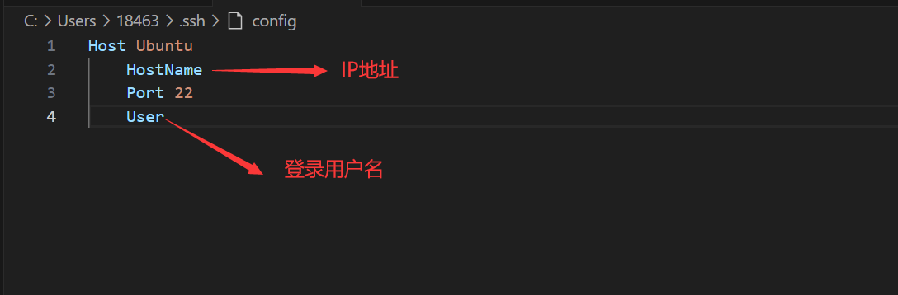

# 安装ssh
---

- **检查是否已安装`openssh-server`**
```shell
# 若已安装则会输出相应信息
yum list installed | grep openssh
```

- **安装`openssh-server`**
```shell
yum install openssh-server
```

- **修改`openssh`配置文件**
```shell
vim /etc/ssh/sshd_config

# 取消以下注释
Port 22
ListenAddress 0.0.0.0
ListenAddress ::
PermitRootLogin yes
PasswordAuthentication yes

# 保存退出并重启服务
systemctl restart sshd

# 查看服务是否运行
ps -e | grep sshd
```

- **安装网络工具**
```shell
yum install net-tools
```

- **查看ip地址**
```shell
ifconfig
```

- **使用vscode远程连接**
  1. 下载插件remote-ssh
  2. 配置ip地址和用户名
